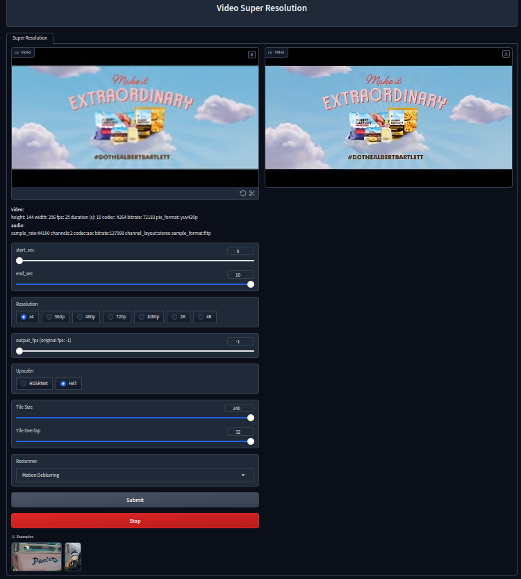

<a name="readme-top"></a>

<div align="center">
  <h3 align="center">Video SR</h3>
</div>
<div align=center>

</div>

## About

Video super-resolution webapp.

Supported models:

- HAT
- HDSRNet
- Restormer (image enhancement)

## Getting Started

You can use this app in Colab now! [Open notebook](https://colab.research.google.com/drive/1ZhCOwWz48KTDS5sf9mkUhv_7fGuaZOWr?usp=sharing)

### Prerequisites

```sh
git clone https://github.com/Frees4/VideoSR.git
sudo apt install ffmpeg
pip install -r requirements.txt
cd lib/HAT && python setup.py develop && cd ../../
```

**If running on local CUDA must be accessible**

## Usage

```sh
python app.py
```

> Visit http://127.0.0.1:7860 in browser, checkout ./output for video results
